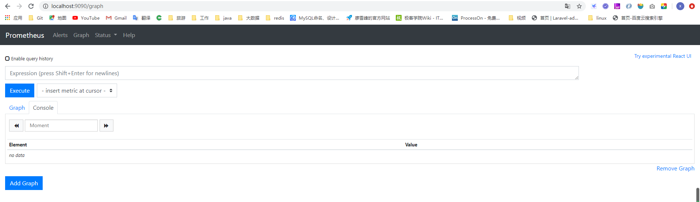
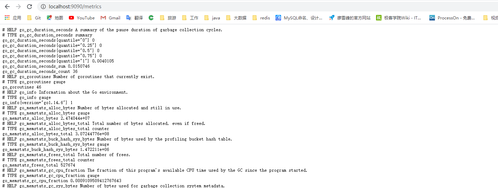
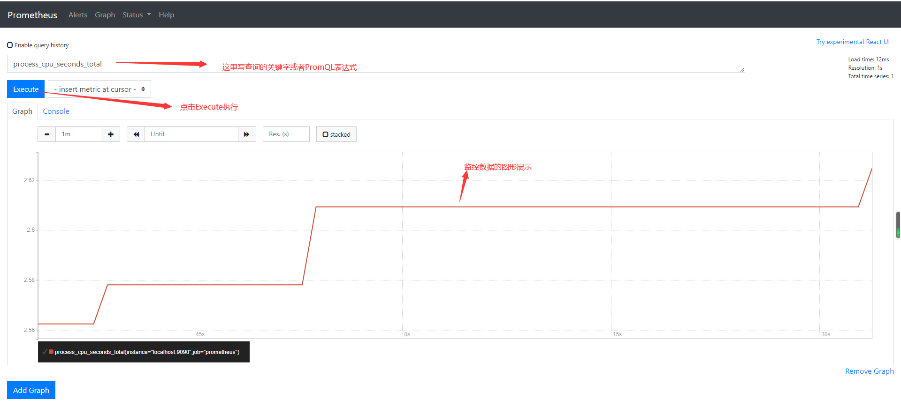
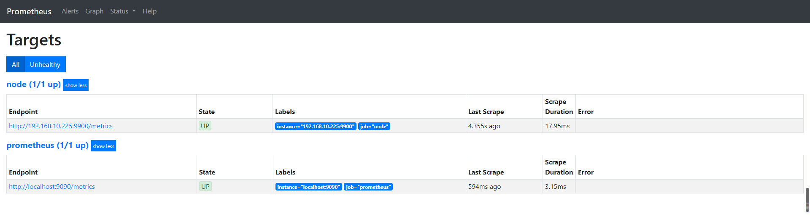
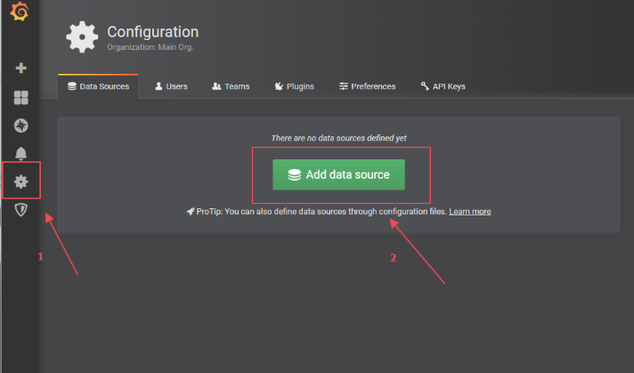

# Prometheus(普罗米修斯)监控系统

## 学习目标

- [ ] 能够安装prometheus服务器

- [ ] 能够通过安装node_exporter监控远程linux

- [ ] 能够通过安装mysqld_exporter监控远程mysql数据库

- [ ] 能够安装grafana

- [ ] 能够在grafana添加promethues数据源

- [ ] 能够在grafana添加监控cpu负载的图形

- [ ] 能够在grafana图形显示mysql监控数据

- [ ] 能够通过grafana+onealert实现报警

## 任务要求

1）部署监控服务器，实现7*24小时监控

2）正对公司的具体业务及研发部门设计监控系统，对监控项和触发器拿出合理意见

3）做好问题预警机制，对可能出现的问题要及时告警并形成严格的处理机制

4）做好监控告警系统，要求可以实现告警分级

​       一级报警 电话通知

​       二级报警 微信通知

​       三级报警 邮件通知

5）处理好公司服务器异地集中监控

## 任务分析

监控四要素：

- 监控对象                 【主机状态，服务，资源，页面，url】

- 用什么监控             【zabbix+server, zabbix+agent】=> Promethues

- 什么时间监控         【7 * 24     5 * 8】

- 报警给谁                 【管理员】

项目选型

- **mrtg** 
- **cacti**
- **ntop**
- **nagios**
- **centreon**
- **ganglia**
- **open-falcon** 小米发布的运维监控系统
- **zabbix**
- **prmetheus**

## 一、普罗米修斯概述

Prometheus（有go语言开发）是一套开源的监控、报警、时间序列数据库的组合。适合监控docker容器。因为Kubernete（k8s）的流行带动了promethues的发展

https://prometheuss.io

## 二、时间序列数据

### 1、什么是时间序列数据

**时间序列数据**(TimeSeries Data)：按照时间顺序记录系统、设备状态变化的数据被称为时序数据。

应用场景很多，如：

- 无人驾驶车辆
- 某个地区各车辆的行驶轨迹数据
- 传统证券行业实施交易数据
- 实时运维监控

### 2、基于时间序列数据特点

- 性能好

关系型数据库对于大规模数据的处理性能糟糕。NOSQL可以比较好的处理大规模数据，依然比不上时间序列数据库。

- 存储成本低

高效的压缩算法，节省存储空间，有效降低IO

Prometheus有着非常高效的时间序列数据存储方法，每个采样数据仅仅占用3.5byte左右空间，上百万条时间序列，30秒间隔，保留60天，大概花200多G

### 3、Prometheus特征

- 多维度数据模型
- 灵活的查询语言
- 不依赖分布式存储，单个服务器节点是自主的
- 以HTTP的方式，通过pull模型拉去时间序列数据
- 也可以通过中间网关支持push模型
- 通过服务发现或者静态配置，来发现目标服务对象
- 支持多种多样的图标和界面展示

### 4、Prometheus监控系统架构图


## 三、实验环境准备

### 1、实验环境搭建

1、实验环境结构

<div>Granfana服务器<div>

Prometheus服务器

被监控服务器

1. 静态ip

2. 主机名

   ```powershell
   各自配置好主机名
   # systemctl set-hostname --static server.cluster.com
   三台都互相绑定IP与主机名
   vim /etc/hosts
   10.1.1.13 server.cluster.com
   10.1.1.14 agent1.cluster.com
   10.1.1.15 grafana.cluster.com   
   ```

2、克隆机器与环境规划

| 编号 | 主机名称             | 主机IP地址 | 角色       |
| ---- | -------------------- | ---------- | ---------- |
| 1    | prometheus.itcast.cn | 10.1.1.17  | prometheus |
| 2    | agent.itcast.cn      | 10.1.1.18  | agent      |
| 3    | grafana.itcast.cn    | 10.1.1.19  | grafana    |

3、初始化服务器

IP地址，HOSTNAME主机名称，绑定/etc/hosts文件，时间同步（非常重要）

IP地址

~~~powershell
修改uuid编号的后三位
dhcp=>none/static
IPADDR=10.1.1.17
IPADDR=10.1.1.18
IPADDR=10.1.1.19
~~~

网络配置

~~~powershell
# vim /etc/sysconfig/network-scripts/ifcfg-ens*

BOOTPROTO="NONE"
IPADDR=10.1.1.17
NETMASK=255.255.255.0
GATEWAY=10.1.1.2
DNS1=8.8.8.8
DNS2=114.114.114.114
UUID=(修改最后三位)

重启网卡：
# systemctl restart network
~~~

HOSTNAME设置

~~~powershell
# hostnamectl set-hostname prometheus.itcast.cn
# hostnamectl set-hostname agent.itcast.cn
# hostnamectl set-hostname grafana.itcast.cn
设置完后执行 # su
~~~

/etc/hosts文件

~~~powershell
10.1.1.17 prometheus prometheus.itcast.cn
10.1.1.18 agent agent.itcast.cn
10.1.1.19 grafana grafana.itcast.cn
~~~

时间同步

~~~powershell
# mount /dev/sr0 /mnt
# yum install ntpdate -y
# ntpdate cn.ntp.org.cn
~~~

### 2、安装Prometheus系统

1、下载软件（2.5）

https://prometheus.io/download/

2、安装软件

1. 上传软件到Linux服务器

2. 解压并安装软件

   ~~~powershell
   # tar -xvzf prometheus-2.5.0.linux-amd64.tar.gz -C /usr/local
   # mv /usr/local/prometheus-2.5.0.linux-amd64 /usr/local/prometheus
   ~~~

3. 启动软件
   ~~~powershell
   直接使用默认配置文件启动
   # /usr/local/prometheus/prometheus --config.file="/usr/local/prometheus/prometheus.yml" &
   ~~~

3. 测试端口占用情况(判断是否真正启动)

   ~~~powershell
   确认端口(9090)
   # lsof -i:9090 (或者 # ss -naltp |grep 9090)
   ~~~


### 3、prometheus界面



### 4、主机数据展示

通过访问 http://ip:9090/metrics ，可看到监控的数据



在web见面可以通过关键字查询监控项



### 5、监控远程linux

1、在远程linux主机（被监控端agent）上安装node_exporter组件

下载地址：https://prometheus.io/download

```powershell
# tar -zxvf node_exporter-0.16.0.linux-amd64.tag.gz -C /usr/local
# mv /usr/local/node_exporter-0.16.0.linux-amd64 /usr/local/node_exporter
里面就一个启动命令node_exporter，可以直接使用此命令启动
# ls /usr/local/node_exporter
# nohup /usr/local/node_exporter/node_exporter &
确认端口

# lsof -i:9100 （或者 # ss naltp |grep 9100）
扩展：nohup命令：如果把启动node_exporter的终端给关闭，那么进程也会随之关闭。nohup命令会帮你解决这个问题。
```


2、通过浏览器访问**http://被监控ip:9100/metrics**就可以查看到node_exporter在被监控端收集的监控信息

~~~
# HELP go_gc_duration_seconds A summary of the pause duration of garbage collection cycles.
# TYPE go_gc_duration_seconds summary
go_gc_duration_seconds{quantile="0"} 2.5722e-05
go_gc_duration_seconds{quantile="0.25"} 0.000124366
go_gc_duration_seconds{quantile="0.5"} 0.000179183
go_gc_duration_seconds{quantile="0.75"} 0.000228674
go_gc_duration_seconds{quantile="1"} 0.000339413
go_gc_duration_seconds_sum 0.021384923
go_gc_duration_seconds_count 123
# HELP go_goroutines Number of goroutines that currently exist.
# TYPE go_goroutines gauge
go_goroutines 10
~~~

3、回到prometheus服务器的配置文件里添加被监控机器的配置段

~~~powershell
在主配置文件最后加上下面三行
# vim /usr/local/prometheus/prometheus.yml
  # 采集node exporter监控数据
  - job_name: 'node'
    static_configs:
    - targets: ['192.168.10.225:9900']

改完配置文件后重启服务
# pkill prometheus
# lsof -i:9900
# cd /usr/local/prometheus
# ./promethues --config.file="/usr/local/prometheus/prometheus.yml" &
# lsof -i:9900
~~~

4、回到管理界面--》Status--》Targets 可以看到多了一个监控目标



### 6、监控远程MySql

1、在被管理机agent上安装mysqld_exporter组件，下载地址：https://prometheus.io/download

~~~powershell
安装mysqld_exporter组件
# tar -xvzf mysqld_exporter-0.11.0.linux-amd64.tar.gz -C /usr/local
# mv /usr/local/mysqld_exporter-0.11.0.linux-amd64 /usr/local/mysqld_exporter
# ls /usr/local/mysqld_exporter

安装mariadb(mysql的一个分支数据库)数据库，并授权
# yum install mariadb\* -y
# systemctl start mariadb
# systemctl enable mariadb
# mysql

mysql> grant select,replication client,process ON *.* to 'mysql_monitor'@'localhost' identified by '口令';
(注意：授权ip为localhost，因为不是prometheus服务器直接找mariadb获取数据，而是prometheus服务器找mysqld_exporter, mysqld_exporter再找mariadb，所以这个localhost是指的mysqld_exporter的IP)

mysql> flush privileges;
mysql> exit;

创建一个mariadb配置文件，写上连接的用户名与密码（和上面的授权的用户名和密码要对应）
# vim /usr/local/mysqld_exporter/.my.cnf
[client]
user=mysql_monitor
password=口令

启动mysqld_exporter
# nohup /usr/local/mysqld_exporter/mysqld_exporter --config.my-cnf=/usr/local/mysqld_exporter/.my.cnf &

确认端口（9104）
# lsof -i:9104 (# ss naltp |grep 9104)
~~~

2、回到prometheus服务器的配置文件里，添加被监控的mysql的配置段

~~~powershell
在主配置文件最后再加上下面三行
#vim /usr/local/prometheus/prometheus.yml
  - job_name: 'mysql'
    static_configs:
    - targets: ['192.168.10.225:9104']
    
修改完配置后重启服务
# pkill prometheus
# lsof -i:9090
# cd /usr/local/prometheus
# ./promethues --config.file="/usr/local/prometheus/prometheus.yml" &
# lsof -i:9900 （or # ss naltp|grep 9090）
~~~

3、回到管理界面--》Status--》Targets 可以看到多了一个监控目标


## 四、Grafana可视化图形工具

### 1、什么是Grafana

Grafana是一个开源的度量分析和可视化工具，可以通过将采集的数据分析，查询，然后进行可视化的展示，并实现报警。

网址：https://grafana.com

### 2、使用Grafana连接Prometheus

1. 在grafana服务器上安装grafana

   下载地址：https://grafana.com/grafana/download

   ```powershell
   使用rpm包，下载后直接rpm -ivh 安装就ok（也可通过yum装 # yum install grafana-5.3.4-1.x86_64.rpm -y）
   # rpm -ivh /root/grafana-5.3.4-1.x86_64.rpm
   启动服务
   # systemctl start grafana-server
   开机启动
   # systemctl enable grafana-server
   确认端口（3000）
   lsof -i:3000
   ```

2. 通过浏览器访问http://grafana服务器ip:3000就到了登录界面，默认用户admin/admin

3. 把prometheus服务器收集到的数据作为一个数据源添加到grafana, 让grafana可以的到prometheus的数据。

   第一步：点击齿轮图标，然后点击Add data source 按钮

   

   第二步：选择Prometheus数据源

   ​	

   第三步：设置数据源码名称和URL

   ​	

   第四步：单击齿轮图标，查看是否添加成功

   ​		

   


### 3、Grafana图形显示MySQL监控数据

1. 在Grafana上修改配置文件，并下载安装mysql监控的dashboard

   参考网址: https://github.com/percona/grafana-dashboards

   ```powershell
   在grafana配置文件里最后加上以下三行
   # vim /etc/grafana/grafana.ini
   [dashboards.json]
   enable = true
   path = /var/lib/grafana/dashboards
   
   # cd /var/lib/grafana/
   # git clone https://github.com/percona/grafana-dashboards.git
   # cp -r grafana-dashboards/dashboards/ /var/lib/grafana/
   重启grafana服务
   # systemctl restart grafana-server
   ```

2. 在grafana图像界面导入相关的json文件

   第一步：点击+号 --》点击import，打开上传页面

   第二步：点击 “Upload .json File” 按钮，选择 “/var/lib/grafana/dashboards/” 目录下相关的json文件

   第三步：选择 "/var/lib/grafana/dashboards/MySQL_Overview.json"导入，然后点击 “Import”按钮

   第四步：点击 “Import” 按钮导入后，报Prometheus数据源找不到，因为这几json文件里默认要找的数据源叫Prometheus

3. 

